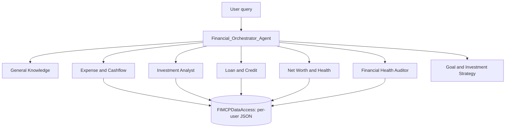

# Hum Safar Hai

**A multi-agent AI financial companion: an orchestrator agent routes natural-language money questions to specialist agents for net worth, expenses, investments, loans, audits and goals.**

Built with Google's Agent Development Kit (ADK) and Gemini. The repo contains the full Python backend, a large suite of tests and an evaluation harness, plus the planning/config files for a Next.js "couples dashboard" frontend.

## What it does

Personal finance data is scattered across bank accounts, mutual funds, loans and credit reports. Hum Safar Hai ("fellow traveller") lets a user ask plain-English questions such as "How is my net worth trending?" or "Should I prepay any loan?" and answers them from structured financial data (net worth, bank transactions, credit report, EPF, mutual-fund transactions, ...) using a team of specialist agents.

## Key features

- **Orchestrator + 7 specialist agents** (`backend/src/orchestration/adk_orchestrator.py`). Each specialist is wrapped as an ADK `AgentTool` and the orchestrator is instructed to delegate rather than answer from scratch:
  - General Knowledge (tax laws, policies, public knowledge)
  - Expense and Cashflow
  - Investment Analyst
  - Loan and Credit
  - Net Worth and Health
  - Financial Health Auditor
  - Goal and Investment Strategy (create/track/update goals for two partners)
- **Financial calculators** (`src/tools/financial_tools.py`, e.g. EMI and SIP).
- **Data access layer** (`src/fi_mcp_data_access.py`) reading per-user JSON files (`fetch_net_worth.json`, `fetch_bank_transactions.json`, ...). The repo ships dummy data for 16 persona folders keyed by fake phone-number IDs, with documentation of the data model.
- **Tests and evaluation**: per-agent tests under `backend/tests/`, an `evaluation/` folder with a dataset, runner scripts and one saved result (4 of 4 test cases passed, 100% pass rate, timestamp 2025-07-23).
- **Frontend plan**: `frontend/docs/blueprint.md` describes a Next.js dashboard (financial overview, couples dashboard, goal tracker, simulation, AI chat UI).

## Tech stack

Python, Google ADK (`google-adk`), Gemini (`gemini-2.5-flash` in `main.py`, via Vertex AI by default), Pydantic, pandas, numpy, FastAPI/uvicorn (listed in requirements), python-dotenv. Frontend scaffolding: Next.js (config only), Firebase App Hosting (`apphosting.yaml`).

## Architecture



## Project structure

```
backend/
  main.py                      # runs the orchestrator on a sample query (ADK Runner, in-memory session)
  setup.sh, requirements.txt
  src/agents/                  # 7 specialist agent factories
  src/orchestration/           # adk_orchestrator.py
  src/tools/financial_tools.py
  src/fi_mcp_data_access.py
  tests/                       # per-agent and phase tests
  evaluation/                  # dataset, runners, saved result
  FI money dummy data/         # dummy persona data + docs
frontend/                      # config + docs/blueprint.md only (no src/ committed)
combined_goals.json
```

## Setup and run

```bash
cd backend
./setup.sh                 # creates venv, installs requirements.txt
# or: python3 -m venv venv && source venv/bin/activate && pip install -r requirements.txt
```
Environment variable names read in `main.py`: `GOOGLE_GENAI_USE_VERTEXAI` (default TRUE), `GOOGLE_CLOUD_PROJECT`, `GOOGLE_CLOUD_LOCATION` (hard-coded to `us-central1`); for AI Studio use `GOOGLE_API_KEY`. Create your own `.env`; do not commit it.

```bash
python main.py             # runs the demo query for the persona set in USER_ID
```
Edit the query and `USER_ID` in `main.py` to try other personas/questions.

## Limitations and future work

- Runs against dummy JSON data; there is no live bank/MCP connection despite the "MCP" naming.
- `main.py` is a demo script, not an API server (FastAPI is a dependency but not wired up here).
- The goal agent is created with two hard-coded persona IDs.
- The frontend source is not in the repo, only its config and blueprint.
- The top-level README link to a demo video is external (Dropbox).
